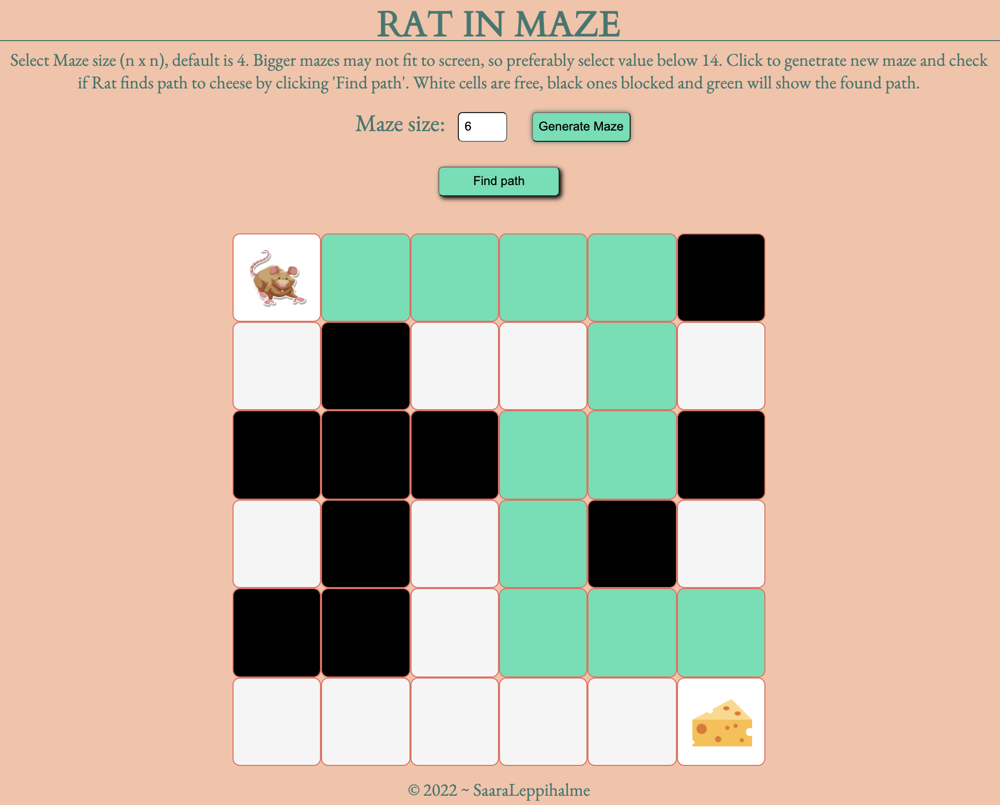
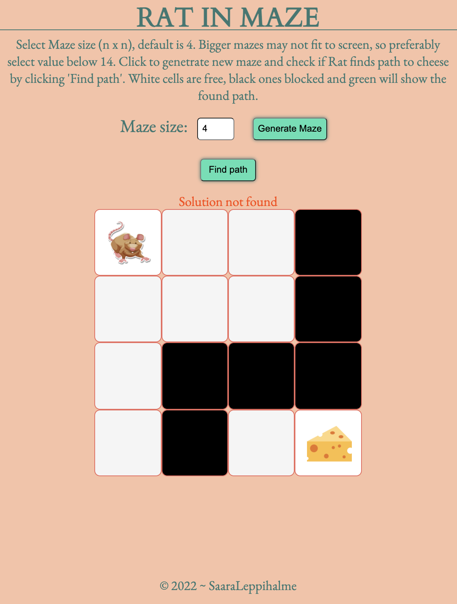

# Rat in Maze with React

This is school assignment @Business College Helsinki.
Related to studies of datastructures.  
 This simple rat in maze is solved with backtarcking and it gives only one solution. Function moves only to right and down directions while looking for the path.

## Technics used

- React
- Javascript/JSX
- CSS

- Backtracking

## How it works

- generate maze: you can give the size (size n\*n), default is 4
- maze will randomly contain free (white) and blocked (black) cells
- after "find path" is clicked the found path is shown in maze (green cells) and if there is no solution, text "Solution not found" will be shown

## To run

```zsh
  npm install
```

```zsh
  npm start
```

## Screenshots




## Learned and development points

    This was first project with React from scratch and it took long to get even the maze generated. I was happy to get all finally function, without just copying ready code.

    Some things I need to point out:
    - how to generate key values in React with best practice
    now the program gives warning as keys are not unique - while indexes used. I studied that it is not good too use indexes and it is recomended to use strings, index should be the last to be used. Hopefully I can get some guidance to get this bug fixed!

    - how to get the bigger mazes to fit to screen so that lines will not break and continue to next line. Or is it possible?
    - should make upgraded rat in maze with all solutions and count & show the shortest way

## Acknowledgements

- Rat picture:
  <a href='https://www.freepik.com/vectors/tree'>Tree vector created by brgfx - www.freepik.com</a>

- Cheese picture:
    <div>Icons made by <a href="https://www.flaticon.com/authors/smalllikeart" title="smalllikeart">smalllikeart</a> from <a href="https://www.flaticon.com/" title="Flaticon">www.flaticon.com</a></div>

- Rat In Maze - Backtracking:
  [Geeks for geeks](https://www.geeksforgeeks.org/rat-in-a-maze-backtracking-2/)

- Multidimensonal Array:
  [multi-diemnsonal Array by Pavneet Singh/Pluralsight](https://www.pluralsight.com/guides/display-multidimensional-array-data-in-react)

- some inspiration from my fellow students' codes [Elena](https://github.com/ElaFinIta/maze) who is always supporting me when I strugle and [Tero](https://github.com/Termanty/rat-maze) who is so good with React and coding and always helpful

## Deployed in Netlify


[](https://app.netlify.com/sites/backtrackmaze-ratman-b05913/deploys)
